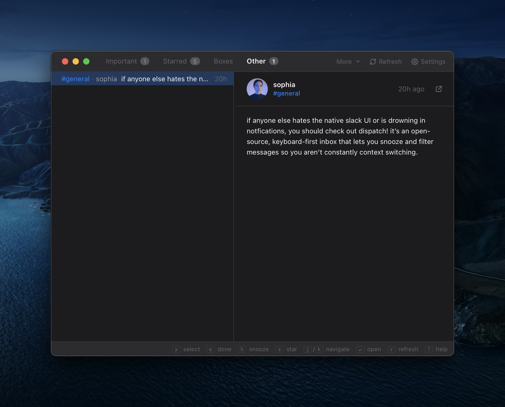
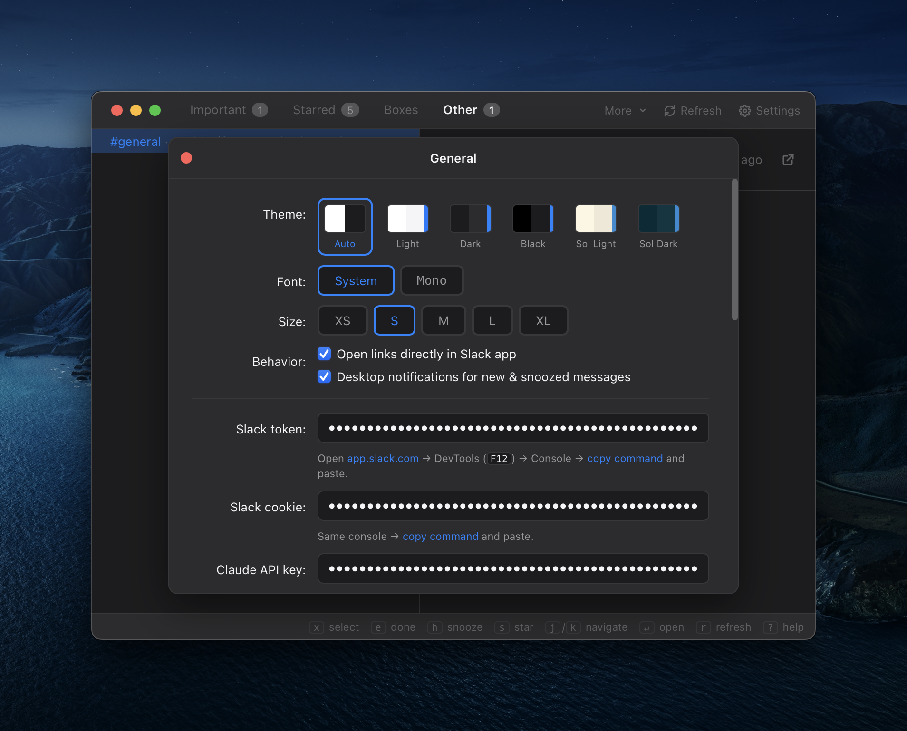

# Dispatch

**Never miss a Slack message.**

A focused Slack inbox that cuts through the noise. 
(aka I wanted Superhuman for Slack, so I built it.) 
Keyboard-first speed. AI-powered triage. Built for macOS.

 

 

---

### Installation

1. Download the `.dmg` from the [latest release](https://github.com/zmh/dispatch/releases/latest)
2. Open the DMG and drag **Dispatch** to **Applications**
3. Open Dispatch from Applications

---

### Filter the Firehose

Decide what gets your attention with keyword, sender, and channel rules. Ignore noisy social chatter and focus on the people, channels, and topics that matter.

### Get Organized

Create split inboxes with keyword, sender, and channel rules. Sort messages by importance, not just by where they were posted.

### Intelligent Classification

Dispatch can optionally use Claude, OpenAI, or Codex to classify important messages, so high-signal updates still surface even when you are not directly mentioned.

### Snooze, Star, Done

Process messages in seconds. Star what needs follow-up, snooze what can wait, and archive what is handled.

### Keyboard-First

Fly through your inbox without touching the mouse. Full keyboard navigation lets you mark items done, snooze for later, or star for follow-up.

---

Five themes. Native macOS typography. Minimal by design.

 

Built with Tauri, React, and Rust.

