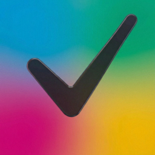

# Dispatch

**Never miss a Slack message.**

A focused inbox for Slack that cuts through the noise. 
Keyboard-driven speed. AI-powered triage. Built for macOS.

 

---

### Filter the Firehose

Choose what messages are monitored with keyword, sender, and channel-based rules. Ignore noisy social channels and focus on the people, channels, and keywords you need to see.

### Get Organized

Create custom split inboxes with keyword, sender, and channel-based rules. Just like email, so you see messages based on how important they are, not just the channel they're in.

### Intelligent Classification

If you want, Dispatch can use Claude to further classify important messages. That way you'll see everything important, even if it doesn't mention you directly.

### Snooze, Star, Done

Process messages in seconds. Star what needs follow-up, snooze what can wait, archive what's handled. Clear your inbox and move on with your day.

### Keyboard-First

Fly through your inbox without touching the mouse. Full keyboard navigation to mark items as done, snooze them for later, or star them to take action.

---

Five themes. Native macOS typography. Minimal by design.

 

Built with Tauri, React, and Rust.

